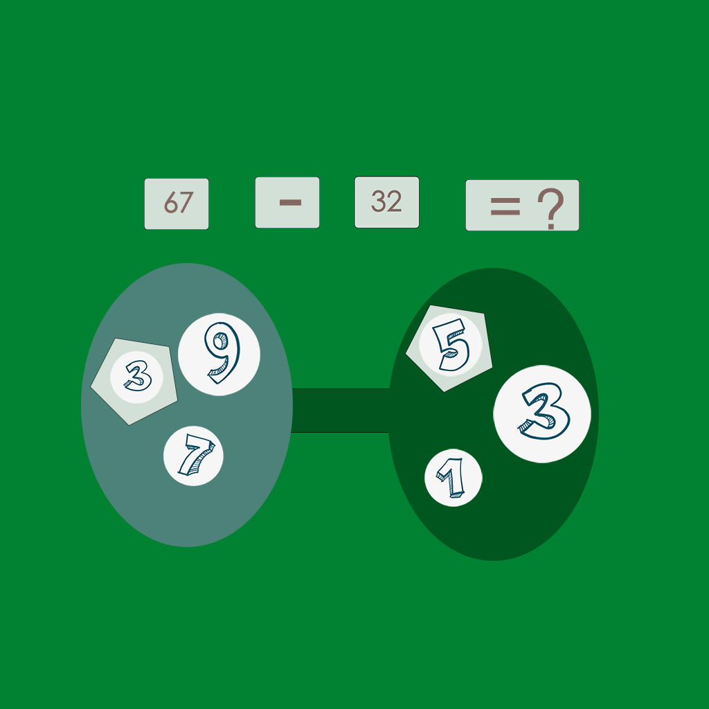

## Welcome to Calculate Combined Answer

This is an application to help you improve your arithmetic ability. You can customize some numbers for practice. Each time you perform calculation, you need to select a number from the answer box on the left as the ten digits of the answer, and a number from the answer box on the right as the one digit of the answer, so that the final answer after the combination of the two numbers is the same as the answer of the equation filled in above. You can also choose different difficulty levels to help you better practice and improve your arithmetic skills.

If you have any questions, you can either leave a message or send the questions to our email address.

We will answer them for you in the first time.

### Address: zhanghesongyuan7@126.com

Thank you!
